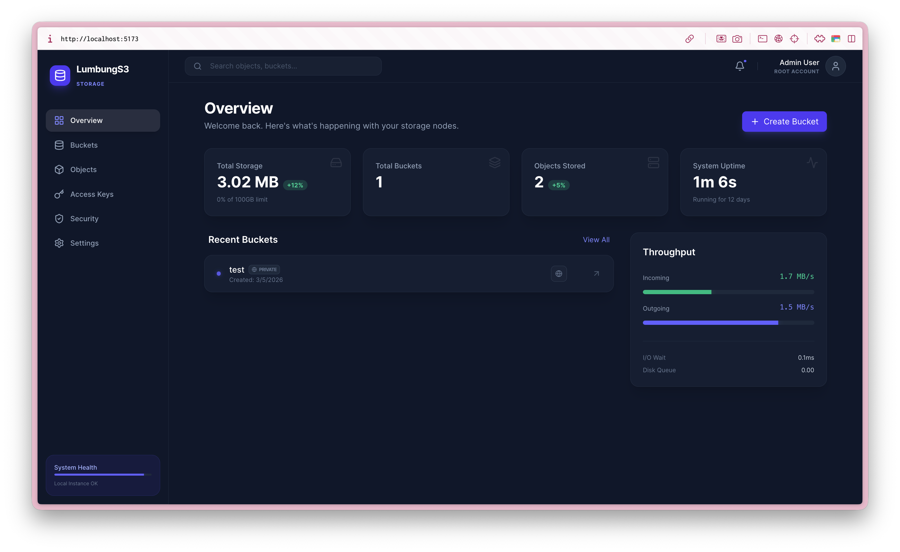

# 🌾 LumbungS3

LumbungS3 is a lightweight, self-hosted, S3-compatible object storage system with a stunning management dashboard. Designed for speed and minimal operational overhead, it leverages the power of **Bun**, **Hono**, **Drizzle ORM**, and **SQLite**.

The name **“Lumbung”** refers to the traditional Indonesian rice storage house, symbolizing a reliable place to store your valuable digital resources.



## ✨ Features

- **S3-Compatible API**: Compatible with standard S3 clients.
- **Modern Dashboard**: Built with React, Vite, and Tailwind CSS 4.0.
- **Drizzle ORM**: Type-safe database interactions with SQLite.
- **Multipart Uploads**: High-performance chunked uploads for large files.
- **Virtual Folders**: Navigate objects using S3-style directory prefixes.
- **Object Versioning**: Keep multiple versions with delete markers and rollback.
- **Lifecycle Rules**: Automatically expire objects and noncurrent versions.
- **Object Metadata & Tags**: Attach key-value metadata and up to 10 tags per object.
- **Presigned URLs**: Secure temporary access for private objects.
- **Live Metrics**: Real-time throughput and storage monitoring.

## 🚀 Quick Start

### Prerequisites

- [Bun](https://bun.sh) installed.

### Installation

```bash
git clone https://github.com/Haslab-dev/LumbungS3.git
cd LumbungS3
bun install
```

### Database Setup

LumbungS3 uses Drizzle ORM. Initialize your database schema with:

```bash
bun run db:push
```

### Development

Start the unified full stack (Frontend + Backend) concurrently:

```bash
bun dev
```

- **Dashboard**: `http://localhost:5173`
- **Unified API**: `http://localhost:9000`

## 🧪 Testing

We provide a formal test suite to verify S3 compatibility and core functionality.

**Ensure the server is running (`bun dev`) before executing tests:**

```bash
# Run all tests (Phase 1 + Phase 2)
bun test
```

## 🛠 Tech Stack

- **Backend**: [Bun](https://bun.sh), [Hono](https://hono.dev), [Drizzle ORM](https://orm.drizzle.team).
- **Frontend**: [React](https://reactjs.org), [Vite](https://vite.dev), [Tailwind CSS 4.0](https://tailwindcss.com), [TanStack Query](https://tanstack.com/query).
- **Storage**: SQLite (WAL mode) with hashed file storage.

## 🗺 Roadmap

### Phase 1: Core (Completed)

- [x] S3-compatible API structure
- [x] Modern Dashboard UI / UX
- [x] Bucket Management (Create/Delete/Visibility)
- [x] Object Operations (Upload/Download/Delete)
- [x] S3-style Multipart Upload
- [x] Presigned URLs for secure access
- [x] Folder Navigation & Breadcrumbs

### Phase 2: Platform (Completed)

- [x] **Object Versioning**: Multiple versions, delete markers, version-specific downloads & deletes.
- [x] **Lifecycle Rules**: Auto-expire objects and noncurrent versions after N days.
- [x] **Object Metadata & Tags**: Key-value metadata CRUD and up to 10 tags per object.

### Phase 3: Distributed

- [ ] Multi-node clustering
- [ ] Geo-replication
- [ ] Erasure coding for high availability

## 📜 License

MIT
